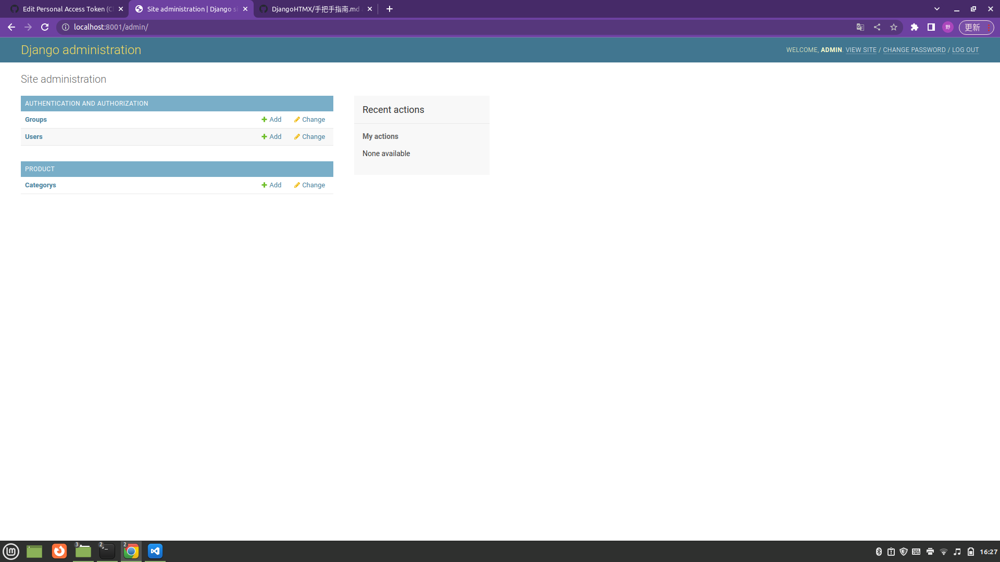

這個是python django + htmx + tailwind 指南 
===
指南（二）-- 98  
指南（三）-- 652  
指南（四）-- 864  
指南（五）-- 1123  
指南（六）-- 1277  

  

[icon用](https://heroicons.com/)    
事前準備：  

建立一個空的資料夾 名稱自定  
如果是用workon 來開 env 請做好設定
---  
指南(一)
要做的事：

-建立/安裝 一個 virtual environment  
-建立一個空白的django 項目  
-建立git .    

---  


一.建立一個 virtual environment
===

---
建立virtual方法不只一種  
## （指南會用方法一） 

## 方法一
1.在目前的資料夾位置打開你的終端機  （terminal）
2.在終端機（terminal）輸入    
```
mkvirtualenv tenv //這個是env的名稱
``` 
建立env成功後

前面會出現一個 (tenv) 這是成功

---

## 方法二  

1.在目前的資料夾位置打開你的終端機  （terminal）
2.在終端機（terminal）輸入    
```
pip3 install virtualenv
```  
3.在終端機（terminal）輸入    
```
virtualenv tenv  //這個是env的名稱
```  
成功後終端機（terminal）會出現以下的畫面

在資料夾裹多了一個tenv資枓夾

4. 在終端機（terminal）輸入  

*這裹注意 window系統 跟linux底系統 的路徑有不同* 
```
source tenv/bin/activate
```
成功後終端機（terminal）會出現以下的畫面

前面會出現一個 (tenv) 這是成功  

---

安裝 django 
===
1.在終端機（terminal）輸入
```
pip install django==3.2
```
2.輸入
```
django-admin startproject Ecommerce .
```

多了一個Ecommerce 資料夾 和 manage.py  

---
建立git.
===

1.在終端機（terminal）裹輸入  

```
 git init 
```

2.在終端機（terminal）輸入
```
ls -la
```  
之後在終端機（terminal）裹有出現git.
  

---
指南（二）-- 98
===

要做的事：  
-建立一個App 名叫 "core"   
-建立一個基本文件 名叫 "base.html"  
-建立一個.gitignore  
-加一個頁面名叫"frontpage"并與"base.html"連結
-在"frontpage"裹加入products  

---  


建立App  
===  

1.  在終端機（terminal）輸入
```
    python manage.py startapp core
```
*注意!! 輸入這個指令前 要留意目前資料夾的位置(是否跟manage.py 同層) 及是否開了evn*  
 

成功後 在目錄上會多了一個 core的資料夾
```
.
├── core
│   ├── admin.py
│   ├── apps.py
│   ├── __init__.py
│   ├── migrations
│   │   └── __init__.py
│   ├── models.py
│   ├── tests.py
│   └── views.py
├── Ecommerce
│   ├── asgi.py
│   ├── __init__.py
│   ├── __pycache__
│   │   ├── __init__.cpython-38.pyc
│   │   └── settings.cpython-38.pyc
│   ├── settings.py
│   ├── urls.py
│   └── wsgi.py
├── manage.py
```

---
## 建立base.html
1. 新建一個名叫templates資料夾 在core app內,  
2. 在templates資料夾內，新建一個core的資料夾,  
3. 在core資料夾內,新建一個檔案名叫 base.html
```
── core
│   ├── admin.py
│   ├── apps.py
│   ├── __init__.py
│   ├── migrations
│   │   └── __init__.py
│   ├── models.py
│   ├── templates
│   │   └── core
│   │       └── base.html
│   ├── tests.py
│   └── views.py


```

base.html
```
<!DOCTYPE html>
<html lang="en">
<head>
    <meta charset="UTF-8">
    <meta http-equiv="X-UA-Compatible" content="IE=edge">
    <meta name="viewport" content="width=device-width, initial-scale=1.0">
    <script src="https://cdn.tailwindcss.com"></script>
    <title>Document</title>
</head>
<body>
    
</body>
</html>

```
---
## 建立.gitignore  
1.在主目錄新建一個檔案名叫.gitignore

```
.
├── core
├── Ecommerce
├── manage.py
├──.gitignore

```

.gitignore
```
# Django #
*.log
*.pot
*.pyc
__pycache__
db.sqlite3
media

# Backup files # 
*.bak 

# If you are using PyCharm # 
# User-specific stuff
.idea/**/workspace.xml
.idea/**/tasks.xml
.idea/**/usage.statistics.xml
.idea/**/dictionaries
.idea/**/shelf

# AWS User-specific
.idea/**/aws.xml

# Generated files
.idea/**/contentModel.xml

# Sensitive or high-churn files
.idea/**/dataSources/
.idea/**/dataSources.ids
.idea/**/dataSources.local.xml
.idea/**/sqlDataSources.xml
.idea/**/dynamic.xml
.idea/**/uiDesigner.xml
.idea/**/dbnavigator.xml

# Gradle
.idea/**/gradle.xml
.idea/**/libraries

# File-based project format
*.iws

# IntelliJ
out/

# JIRA plugin
atlassian-ide-plugin.xml

# Python # 
*.py[cod] 
*$py.class 

# Distribution / packaging 
.Python build/ 
develop-eggs/ 
dist/ 
downloads/ 
eggs/ 
.eggs/ 
lib/ 
lib64/ 
parts/ 
sdist/ 
var/ 
wheels/ 
*.egg-info/ 
.installed.cfg 
*.egg 
*.manifest 
*.spec 

# Installer logs 
pip-log.txt 
pip-delete-this-directory.txt 

# Unit test / coverage reports 
htmlcov/ 
.tox/ 
.coverage 
.coverage.* 
.cache 
.pytest_cache/ 
nosetests.xml 
coverage.xml 
*.cover 
.hypothesis/ 

# Jupyter Notebook 
.ipynb_checkpoints 

# pyenv 
.python-version 

# celery 
celerybeat-schedule.* 

# SageMath parsed files 
*.sage.py 

# Environments 
.env 
.venv 
env/ 
venv/ 
ENV/ 
env.bak/ 
venv.bak/ 

# mkdocs documentation 
/site 

# mypy 
.mypy_cache/ 

# Sublime Text # 
*.tmlanguage.cache 
*.tmPreferences.cache 
*.stTheme.cache 
*.sublime-workspace 
*.sublime-project 

# sftp configuration file 
sftp-config.json 

# Package control specific files Package 
Control.last-run 
Control.ca-list 
Control.ca-bundle 
Control.system-ca-bundle 
GitHub.sublime-settings 

# Visual Studio Code # 
.vscode/* 
!.vscode/settings.json 
!.vscode/tasks.json 
!.vscode/launch.json 
!.vscode/extensions.json 
.history

```
---
### 運行server
現在試試開著server運行  
運行前先做一些設定  

1.  打開 project Ecommerce 裹的settings.py
```
├── Ecommerce
│   ├── asgi.py
│   ├── __init__.py
│   ├── __pycache__
│   ├── settings.py  <----這個
│   ├── urls.py
│   └── wsgi.py

```
settings.py裹 在這裹 增加 App core
```
//Ecommerce/settings.py

INSTALLED_APPS = [
    'django.contrib.admin',
    'django.contrib.auth',
    'django.contrib.contenttypes',
    'django.contrib.sessions',
    'django.contrib.messages',
    'django.contrib.staticfiles',
    'core'
]
```
2. 在Ecommerce 的 urls.py 裹
```
// Ecommerce/urls.py
from django.contrib import admin
from django.urls import path ,include


urlpatterns = [
    path('', include('core.urls')),
    path('admin/', admin.site.urls),
]

```
3 . 在App core 裹新建檔案 名叫urls.py  
urls.py
```
// core/urls.py
from django.urls import path 
from .views import page

urlpatterns = [
    path('', page , name="page")

]

```
4. App core 的views.py  
views.py
```
from django.shortcuts import render

# Create your views here.

def page(request):
    return render(request, 'core/base.html')
```

5. 所有設定都完成了 可以運行server了。  
在終端機（terminal）裹
```
python manage.py runserver 8000
```
之後打開你的瀏覽器  
輸入 localhost:8000  
正常是一篇白空!!  這是成功了!!


---
## 建設base.html

base.html
```
<!doctype html>

<html>
    <head>
        <meta charset="UTF-8">
        <meta name="viewport" content="width=device-width, initial-scale=1.0">
        <script src="https://cdn.tailwindcss.com"></script>
    </head>

    <body>
        <nav class="border-b border-gray-300">
            <div class="max-w-6xl mx-auto py-2 px-6 xl:px-0 flex items-center justify-between">
                <div class="menu-left flex items-center space-x-6">
                    <a href="#" class="py-4 text-lg text-purple-500 font-semibold">Ecommerce</a>

                    <ul class="flex items-center space-x-4">
                        <li><a href="#">商店</a></li>
                        <li><a href="#">關於</a></li>
                    </ul>
                </div>

                <div class="menu-right flex items-center space-x-4">
                    <a href="#">
                        <svg xmlns="http://www.w3.org/2000/svg" class="h-6 w-6" fill="none" viewBox="0 0 24 24" stroke="currentColor">
                            <path stroke-linecap="round" stroke-linejoin="round" stroke-width="2" d="M5.121 17.804A13.937 13.937 0 0112 16c2.5 0 4.847.655 6.879 1.804M15 10a3 3 0 11-6 0 3 3 0 016 0zm6 2a9 9 0 11-18 0 9 9 0 0118 0z" />
                        </svg>
                    </a>

                    <a href="#">
                        <svg xmlns="http://www.w3.org/2000/svg" class="h-6 w-6" fill="none" viewBox="0 0 24 24" stroke="currentColor">
                            <path stroke-linecap="round" stroke-linejoin="round" stroke-width="2" d="M16 11V7a4 4 0 00-8 0v4M5 9h14l1 12H4L5 9z" />
                        </svg>
                    </a>
                </div>
            </div>
        </nav>
        <header class="px-6 py-10 lg:py-20 bg-purple-500">
            <div class="max-w-3xl mx-auto text-center">
                <p class="mb-2 text-3xl lg:text-5xl text-white">Welcome to Ecommerce</p>
        
                <p class="mb-10 text-white">Ecommerce</p>
        
                <a href="#" class="inline-block px-8 py-4 rounded-xl bg-white text-purple-500 hover:bg-gray-200">Start shopping</a>
            </div>
        </header>

        <footer class="bg-gray-100">
            <div class="max-w-6xl mx-auto py-10 px-6 xl:px-0 md:flex justify-between">
                <div class="footer-left mb-12 md:mb-0">
                    <h2 class="mb-5 uppercase text-lg">關於我們</h2>

                    <p class="text-gray-700">是但</p>
                </div>

                <div class="footer-right">
                    <h2 class="mb-5 uppercase text-lg">聯絡</h2>

                    <ul class="space-y-2">
                        <li><a href="#" class="text-purple-500 hover:text-purple-800">Facebook</a></li>
                        <li><a href="#" class="text-purple-500 hover:text-purple-800">Twitter</a></li>
                        <li><a href="#" class="text-purple-500 hover:text-purple-800">Instagram</a></li>
                    </ul>
                </div>
            </div>
        </footer>
    </body>
</html>
```

## 建立frontpage頁面

1.在App core 裹  

/templates/core 這裹新建檔案名叫 frontpage.html  
frontpage.html

```


<header class="px-6 py-10 lg:py-20 bg-purple-500">
    <div class="max-w-3xl mx-auto text-center">
        <p class="mb-2 text-3xl lg:text-5xl text-white">Welcome to Ecommerce</p>

        <p class="mb-10 text-white">Ecommerce</p>

        <a href="#" class="inline-block px-8 py-4 rounded-xl bg-white text-purple-500 hover:bg-gray-200">Start shopping</a>
    </div>
</header>

```

base.html  
```
// header 位置變成這樣
        
        
```
在App core  
core/views.py
```
from django.shortcuts import render

# Create your views here.

def frontpage(request):
    return render(request, 'core/frontpage.html') 
```

core/urls.py
```
from django.urls import path 
from .views import frontpage

urlpatterns = [
    path('', frontpage , name="page")

]

```
---
## 加入products
frontpage.html
```


<header class="px-6 py-10 lg:py-20 bg-purple-500">
    <div class="max-w-3xl mx-auto text-center">
        <p class="mb-2 text-3xl lg:text-5xl text-white">Welcome to Ecommerce</p>

        <p class="mb-10 text-white">Ecommerce</p>

        <a href="#" class="inline-block px-8 py-4 rounded-xl bg-white text-purple-500 hover:bg-gray-200">Start shopping</a>
    </div>
</header>
<div class="max-w-6xl mx-auto py-2 px-6 xl:px-0">
    <div class="products flex items-center flex-wrap">
        <div class="w-full md:w-1/3 xl:w-1/4 p-6">
            <a href="#">
                
            </a>

            <div class="pt-3 flex items-center justify-between">
                <a href="#">Product name</a>

                <a href="#" class="text-purple-500 hover:text-purple-800">
                    <svg xmlns="http://www.w3.org/2000/svg" class="h-6 w-6" fill="none" viewBox="0 0 24 24" stroke="currentColor">
                        <path stroke-linecap="round" stroke-linejoin="round" stroke-width="2" d="M16 11V7a4 4 0 00-8 0v4M5 9h14l1 12H4L5 9z" />
                    </svg>
                </a>
            </div>

            <p class="pt-1 text-gray-400">$9.99</p>
        </div>

        <div class="w-full md:w-1/3 xl:w-1/4 p-6">
            <a href="#">
                
            </a>

            <div class="pt-3 flex items-center justify-between">
                <a href="#">Product name</a>

                <a href="#" class="text-purple-500 hover:text-purple-800">
                    <svg xmlns="http://www.w3.org/2000/svg" class="h-6 w-6" fill="none" viewBox="0 0 24 24" stroke="currentColor">
                        <path stroke-linecap="round" stroke-linejoin="round" stroke-width="2" d="M16 11V7a4 4 0 00-8 0v4M5 9h14l1 12H4L5 9z" />
                    </svg>
                </a>
            </div>

            <p class="pt-1 text-gray-400">$9.99</p>
        </div>
        
        <div class="w-full md:w-1/3 xl:w-1/4 p-6">
            <a href="#">
                
            </a>

            <div class="pt-3 flex items-center justify-between">
                <a href="#">Product name</a>

                <a href="#" class="text-purple-500 hover:text-purple-800">
                    <svg xmlns="http://www.w3.org/2000/svg" class="h-6 w-6" fill="none" viewBox="0 0 24 24" stroke="currentColor">
                        <path stroke-linecap="round" stroke-linejoin="round" stroke-width="2" d="M16 11V7a4 4 0 00-8 0v4M5 9h14l1 12H4L5 9z" />
                    </svg>
                </a>
            </div>

            <p class="pt-1 text-gray-400">$9.99</p>
        </div>

        <div class="w-full md:w-1/3 xl:w-1/4 p-6">
            <a href="#">
                
            </a>

            <div class="pt-3 flex items-center justify-between">
                <a href="#">Product name</a>

                <a href="#" class="text-purple-500 hover:text-purple-800">
                    <svg xmlns="http://www.w3.org/2000/svg" class="h-6 w-6" fill="none" viewBox="0 0 24 24" stroke="currentColor">
                        <path stroke-linecap="round" stroke-linejoin="round" stroke-width="2" d="M16 11V7a4 4 0 00-8 0v4M5 9h14l1 12H4L5 9z" />
                    </svg>
                </a>
            </div>

            <p class="pt-1 text-gray-400">$9.99</p>
        </div>

        <div class="w-full md:w-1/3 xl:w-1/4 p-6">
            <a href="#">
                
            </a>

            <div class="pt-3 flex items-center justify-between">
                <a href="#">Product name</a>

                <a href="#" class="text-purple-500 hover:text-purple-800">
                    <svg xmlns="http://www.w3.org/2000/svg" class="h-6 w-6" fill="none" viewBox="0 0 24 24" stroke="currentColor">
                        <path stroke-linecap="round" stroke-linejoin="round" stroke-width="2" d="M16 11V7a4 4 0 00-8 0v4M5 9h14l1 12H4L5 9z" />
                    </svg>
                </a>
            </div>

            <p class="pt-1 text-gray-400">$9.99</p>
        </div>
    </div>
</div>

```
---
指南（三）-- 652
===

要做的事：  
-建立一個App 名叫 product  
-建立一個 category database 模組  
-加入categories 在 admin 界面  
-建立一個 products database 模組  
-加入products 在 admin 界面  
-在front page 頁面 顯示 products

---

## 建立product App
1. 在終端機（terminal）裹  
```
python manage.py startapp product
```
```
.
├── core
├── db.sqlite3
├── Ecommerce
├── manage.py
├── product
```
---
## 建立category database 模組  
 1. product/models.py
 ```
 class Category(models.Model):
    name = models.CharField(max_length=255)
    slug = models.SlugField()

    class Meta:
        ordering = ('name',)
    
    def __str__(self):
        return self.name
 ```

---
## 加入categories 在 admin 界面  
1. product/admin.py
```
from django.contrib import admin

# Register your models here.

from .models import Category

admin.site.register(Category)
```
2. Ecommerce/settings.py
```
INSTALLED_APPS = [
    'django.contrib.admin',
    'django.contrib.auth',
    'django.contrib.contenttypes',
    'django.contrib.sessions',
    'django.contrib.messages',
    'django.contrib.staticfiles',
    'core',
    'product', //加入product
]

```
3. 在終端機（terminal）裹   

```
python manage.py makemigrations

python manage.py migrate
```  

4. 完成第2步後，開始建立超級用戶  
在終端機（terminal）裹 
```
python manage.py createsuperuser
```
```
Username (leave blank to use 'user'): admin //輸入用戶名稱
Email address:  //可以留空白
Password:   //6個字以上
Password (again): //跟Password一樣
```
完成後 會出一句  
 Superuser created successfully.   
 就是成功  

---

### 之後試運行server , 去localhost:8000/admin

登入
  
按add  

在此加入類別 之後按save  
(因個人喜好加入類別數量)

---  
## 建立Product database model  
1.product/models  
```
from django.db import models

# Create your models here.

class Category(models.Model):
    name = models.CharField(max_length=255)
    slug = models.SlugField()

    class Meta:
        ordering = ('name',)
    
    def __str__(self):
        return self.name

 //加入product model
class Product(models.Model):
    category = models.ForeignKey(Category, related_name='products', on_delete=models.CASCADE)
    name = models.CharField(max_length=255)
    slug = models.SlugField()
    description = models.TextField(blank=True, null=True)
    price = models.IntegerField()
    created_at = models.DateTimeField(auto_now_add=True)

    class Meta:
        ordering = ('-created_at',)
    
    def __str__(self):
        return self.name
```
---
## 加入products 在 admin 界面
1. product/admin.py
```
from django.contrib import admin

# Register your models here.
//加入 Product

from .models import Category, Product

admin.site.register(Category)
admin.site.register(Product)
```
2. 在終端機（terminal）裹   
```
python manage.py makemigrations

python manage.py migrate
```
之後再返回localhost:8000/admin

多了products

---
## 在front page 頁面 顯示 products
在localhost:8000/admin
1. prodoucts行按add 
2. (因個人喜好加入商品數量)  


3. core/view.py
```
from django.shortcuts import render

from product.models import Product  //import Product DB
# Create your views here.

def frontpage(request):
    products = Product.objects.all()[0:8] // 用 Product DB
    return render(request, 'core/frontpage.html', {'products': products}) 
    //把DB內容傳入template
```

4. core/templates/core/frontpage.html
```


...

<div class="max-w-6xl mx-auto py-2 px-6 xl:px-0">
    <div class="products flex items-center flex-wrap">
        
            <div class="w-full md:w-1/3 xl:w-1/4 p-6">
                <a href="#">
                    
                </a>

                <div class="pt-3 flex items-center justify-between">
                    <a href="#">{{ product.name }}</a>

                    <a href="#" class="text-purple-500 hover:text-purple-800">
                        <svg xmlns="http://www.w3.org/2000/svg" class="h-6 w-6" fill="none" viewBox="0 0 24 24" stroke="currentColor">
                            <path stroke-linecap="round" stroke-linejoin="round" stroke-width="2" d="M16 11V7a4 4 0 00-8 0v4M5 9h14l1 12H4L5 9z" />
                        </svg>
                    </a>
                </div>

                <p class="pt-1 text-gray-400">$9.99</p>
            </div>
        
    </div>
</div>

```
---
指南（四）-- 862
===
要做的事：  
-建立 category/shop html頁面  
-建立 product內容 html頁面

---
## 建立 category/shop html頁面 
1. core/views.py 
```
...
//加入shop page function
def shop(request):
    products = Product.objects.all()

    return render(request, 'core/shop.html', {'products': products})
```
2. 在core/templates/core新建shop.html的檔案  
shop.html
```




<div class="max-w-6xl mx-auto py-2 px-6 xl:px-0">
    <div class="products flex items-center flex-wrap">
        
            <div class="w-full md:w-1/3 xl:w-1/4 p-6">
                <a href="#">
                    
                </a>

                <div class="pt-3 flex items-center justify-between">
                    <a href="#">{{ product.name }}</a>

                    <a href="#" class="text-purple-500 hover:text-purple-800">
                        <svg xmlns="http://www.w3.org/2000/svg" class="h-6 w-6" fill="none" viewBox="0 0 24 24" stroke="currentColor">
                            <path stroke-linecap="round" stroke-linejoin="round" stroke-width="2" d="M16 11V7a4 4 0 00-8 0v4M5 9h14l1 12H4L5 9z" />
                        </svg>
                    </a>
                </div>

                <p class="pt-1 text-gray-400">$9.99</p>
            </div>
        
    </div>


```
3. 在Ecommerce/urls.py   
```
from django.contrib import admin
from django.urls import path ,include
from core.views import shop <---加入 core/views.py 裹 shop function

urlpatterns = [
    path('', include('core.urls')),
    path('shop/', shop ,name="shop"), <-- 建立shop 的url /api
    path('admin/', admin.site.urls),
]


```
4. core/templates/core/base.html

```
...
                    <ul class="flex items-center space-x-4">
                        <li><a href="">商店</a></li> <--這裹的#改掉
                        <li><a href="#">關於</a></li>
                    </ul>
                </div>
...
```
加入一個搜索位
5. core/templates/core/shop.html  
shop.html
```
<div class="max-w-6xl mx-auto flex flex-wrap items-start py-6 px-6 xl:px-0"> <--多了flex flex-wrap 
    <div class="filters w-full lg:w-1/4">
        <h3 class="mb-3 text-xl uppercase">Search</h3>

        <form>
            <div class="flex">
                <input type="text" class="p-4 bg-gray-100 border-0" placeholder="Search...">

                <button class="p-4 bg-gray-100 border-0">
                    <svg xmlns="http://www.w3.org/2000/svg" class="h-6 w-6" fill="none" viewBox="0 0 24 24" stroke="currentColor">
                        <path stroke-linecap="round" stroke-linejoin="round" stroke-width="2" d="M21 21l-6-6m2-5a7 7 0 11-14 0 7 7 0 0114 0z" />
                    </svg>
                </button>
            </div>
        </form>
    </div>
    <div class="products w-full lg:w-3/4 flex items-center flex-wrap">  <-- w-full lg:w-3/4
 ...

```
之後再加多一個類別位
6. 都是在core/templates/core/shop.html  
shop.html
```
...
    <div class="filters w-full lg:w-1/4">
        <h3 class="mb-3 text-xl uppercase">Search</h3>

        <form>
            <div class="flex">
                <input type="text" class="p-4 bg-gray-100 border-0" placeholder="Search...">

                <button class="p-4 bg-gray-100 border-0">
                    <svg xmlns="http://www.w3.org/2000/svg" class="h-6 w-6" fill="none" viewBox="0 0 24 24" stroke="currentColor">
                        <path stroke-linecap="round" stroke-linejoin="round" stroke-width="2" d="M21 21l-6-6m2-5a7 7 0 11-14 0 7 7 0 0114 0z" />
                    </svg>
                </button>
            </div>
        </form>

//多了這個
        <h3 class="mt-6 mb-3 text-xl uppercase">Categories</h3>

        <ul class="space-y-2">
            <li><a href="#" class="text-purple-500">All categories</a></li>
            <li><a href="#" class="text-gray-500">名</a></li>
            <li><a href="#" class="text-gray-500">名</a></li>
            <li><a href="#" class="text-gray-500">名</a></li>
        </ul>
//直到這
    </div>
...

```

整個 shop.html 

```



<div class="max-w-6xl mx-auto flex flex-wrap items-start py-6 px-6 xl:px-0"> <---有小改
    <div class="filters w-full lg:w-1/4">
        <h3 class="mb-3 text-xl uppercase">Search</h3>

        <form>
            <div class="flex">
                <input type="text" class="p-4 bg-gray-100 border-0" placeholder="Search...">

                <button class="p-4 bg-gray-100 border-0">
                    <svg xmlns="http://www.w3.org/2000/svg" class="h-6 w-6" fill="none" viewBox="0 0 24 24" stroke="currentColor">
                        <path stroke-linecap="round" stroke-linejoin="round" stroke-width="2" d="M21 21l-6-6m2-5a7 7 0 11-14 0 7 7 0 0114 0z" />
                    </svg>
                </button>
            </div>
        </form>

        <h3 class="mt-6 mb-3 text-xl uppercase">Categories</h3>

        <ul class="space-y-2">
            <li><a href="#" class="text-purple-500">All categories</a></li>
            <li><a href="#" class="text-gray-500">名</a></li>
            <li><a href="#" class="text-gray-500">名</a></li>
            <li><a href="#" class="text-gray-500">名</a></li>
        </ul>
    </div>

    <div class="products w-full lg:w-3/4 -mt-4 flex items-center flex-wrap">
        
            <div class="w-full md:w-1/3 xl:w-1/4 p-6">
                <a href="#">
                    
                </a>

                <div class="pt-3 flex items-center justify-between">
                    <a href="#">{{ product.name }}</a>

                    <a href="#" class="text-purple-500 hover:text-purple-800">
                        <svg xmlns="http://www.w3.org/2000/svg" class="h-6 w-6" fill="none" viewBox="0 0 24 24" stroke="currentColor">
                            <path stroke-linecap="round" stroke-linejoin="round" stroke-width="2" d="M16 11V7a4 4 0 00-8 0v4M5 9h14l1 12H4L5 9z" />
                        </svg>
                    </a>
                </div>

                <p class="pt-1 text-gray-400">$9.99</p>
            </div>
        
    </div>
</div>


```
---
## 建立 product內容 html頁面
1. 在App product 裹
開一個templates資料夾，templates資料夾裹面再開一個product資料夾,
最後在product資料夾裹,開product.html
```
├── product
│   ├── admin.py
│   ├── apps.py
│   ├── __init__.py
│   ├── migrations
│   ├── models.py
│   ├── __pycache__
│   ├── templates
│   │   └── product
│   │       └── product.html
│   ├── tests.py
│   └── views.py

```  
product.html
```



<div class="max-w-6xl mx-auto flex flex-wrap py-6 px-6 xl:px-0">
    <div class="images w-full mb-6 lg:mb-0 lg:w-3/5">
        
    </div>

    <div class="information w-full lg:w-2/5 lg:p-6">
        <h1 class="text-2xl">Product Name</h1>

        <p class="mt-1 text-gray-400">$9.99</p>

        <p class="mt-6 text-gray-700">Lorem ipsum dolor sit amet. Lorem ipsum dolor sit amet. Lorem ipsum dolor sit amet. Lorem ipsum dolor sit amet.</p>

        <a href="#" class="mt-6 inline-block px-8 py-4 rounded-xl bg-purple-500 text-white hover:bg-purple-700">
            Add to cart
        </a>
    </div>
</div>

```  
2. product/views.py
```
from django.shortcuts import render

def product(request):
    return render(request, 'product/product.html')
```
3. Ecommerce/urls.py
```
from core.views import shop
from product.views import product <--引入product


urlpatterns = [
    path('', include('core.urls')),
    path('shop/', shop ,name="shop"),
    path('product/', product , name="product"), <--加入product url/api
    path('admin/', admin.site.urls),
]


```
---
指南（五）-- 1123
===
耍做的事：  
-在側欄顯示類別  
-顯示類別內容  
-簡單搜索商品功能  

---
## 在側欄顯示類別 
1. core/views.py  
views.py  
```
...

from product.models import Product, Category <-- 加入Category models

...

def shop(request):
    categories = Category.objects.all() <-- 用Category DB
    products = Product.objects.all()

    context = {
        'categories':categories,
        'products':products,
    } //用context 包著以上資料

    return render(request, 'core/shop.html', context) //用context傳入template
```
2. core/templates/core/shop.html  
shop.html  
```
...
    //Categoy 有修改
        <h3 class="mt-6 mb-3 text-xl uppercase">Categories</h3>

        <ul class="space-y-2">
            <li><a href="" class="text-purple-500">All categories</a></li>
            
            <li><a href="?category={{category.slug}}" class="text-gray-500">{{ category.name }}</a></li>
            
        </ul>
...

```

---
## 顯示類別內容 
1. core/views.py
```
... 

def shop(request):
    categories = Category.objects.all()
    products = Product.objects.all()

    active_category = request.GET.get('category', '') <-- 拿url 裹的params

    context = {
        'categories':categories,
        'products':products,
        'active_category': active_category <-- 放入context
    }

    return render(request, 'core/shop.html', context)
```
2. core/templates/core/shop.html
```
...
        <ul class="space-y-2">
            <li><a href="" class="text-purple-500text-gray-500">All categories</a></li> //加入 active_category 判別

            
                <li><a href="?category={{ category.slug }}" class="text-purple-500text-gray-500">{{ category.name }}</a></li>
                //加入 active_category 判別
            
...
```
這就可以用傾欄自由轉換頁面
3. 最後在core/views.py
```
...
def shop(request):
    categories = Category.objects.all()
    products = Product.objects.all()

    active_category = request.GET.get('category', '')

    if active_category: 
        products = products.filter(category__slug=active_category) //加入 active_category 判別

    context = {
        'categories':categories,
        'products':products,
        'active_category': active_category
    }

    return render(request, 'core/shop.html', context)

```

---
## 簡單搜索商品功能
1. core/templates/core/shop.html
```
        ...
        <form method="get" action="."> //加入 method action
            <div class="flex">
                <input type="text" name="query" class="p-4 bg-gray-100 border-0" placeholder="Search..."> //加入name

                <button class="p-4 bg-gray-100 border-0">
                    <svg xmlns="http://www.w3.org/2000/svg" class="h-6 w-6" fill="none" viewBox="0 0 24 24" stroke="currentColor">
                        <path stroke-linecap="round" stroke-linejoin="round" stroke-width="2" d="M21 21l-6-6m2-5a7 7 0 11-14 0 7 7 0 0114 0z" />
                    </svg>
                </button>
            </div>
        </form>
        ...
```
2. core/views.py
```
from django.shortcuts import render
from django.db.models import Q  //加入
from product.models import Product, Category
# Create your views here.

def frontpage(request):
    products = Product.objects.all()[0:8]
    return render(request, 'core/frontpage.html', {'products': products})

def shop(request):
    categories = Category.objects.all()
    products = Product.objects.all()

    active_category = request.GET.get('category', '')

    if active_category:
        products = products.filter(category__slug=active_category)

    query = request.GET.get('query', '') //拿url 的query

    if query: // query 判別
        products = products.filter(Q(name__icontains=query) | Q(description__icontains=query))


    context = {
        'categories':categories,
        'products':products,
        'active_category': active_category
    }

    return render(request, 'core/shop.html', context)
```
---
指南（六）-- 1277
===
要做的事：  
-價錢修改  
-navbar  
-顯示產品詳細頁面

---
## 價錢修改  
1. product/models.py
```
...
class Product(models.Model):
    category = models.ForeignKey(Category, related_name='products', on_delete=models.CASCADE)
    name = models.CharField(max_length=255)
    slug = models.SlugField()
    description = models.TextField(blank=True, null=True)
    price = models.IntegerField()
    created_at = models.DateTimeField(auto_now_add=True)

    class Meta:
        ordering = ('-created_at',)
    
    def __str__(self):
        return self.name

    def get_display_price(self): //加入get_display_price function
        return self.price / 100

```
2. core/templates/core/shop.html
```
    ...
    <p class="pt-1 text-gray-400">${{ product.get_display_price }}</p> //把價錢改成 product db 的 get_display_price
    ...
```

---
## 可重複使用產品列表

1. core/templates/core/frontpage.html
```
...
<div class="max-w-6xl mx-auto py-2 px-6 xl:px-0">
    <div class="products flex items-center flex-wrap">
        
             //include product_list_item.html
        
    </div>
</div>
...

```
2. core/templates/core/shop.html
```
...
    <div class="products w-full lg:w-3/4 -mt-4 flex items-center flex-wrap">
        
            
        
    </div>
...
```


3. 在product/templates/product裹建立parttials資料夾，parttials資料夾裹建立product_list_item.html  
```
├── product
│   ├── admin.py
│   ├── apps.py
│   ├── __init__.py
│   ├── migrations
│   ├── models.py
│   ├── __pycache__
│   ├── templates
│   │   └── product
│   │       ├── partials
│   │       │   └── product_list_item.html
│   │       └── product.html
│   ├── tests.py
│   └── views.py


```

4. product/templates/product/partials/product_list_item.html
```
<div class="w-full md:w-1/3 xl:w-1/4 p-6">
    <a href="#">
        
    </a>

    <div class="pt-3 flex items-center justify-between">
        <a href="#">{{ product.name }}</a>

        <a href="#" class="text-purple-500 hover:text-purple-800">
            <svg xmlns="http://www.w3.org/2000/svg" class="h-6 w-6" fill="none" viewBox="0 0 24 24" stroke="currentColor">
                <path stroke-linecap="round" stroke-linejoin="round" stroke-width="2" d="M16 11V7a4 4 0 00-8 0v4M5 9h14l1 12H4L5 9z" />
            </svg>
        </a>
    </div>

    <p class="pt-1 text-gray-400">${{ product.get_display_price }}</p>
</div>
```

5. core/templates/core/base.html
```
                ...
                    <a href="" class="py-4 text-lg text-purple-500 font-semibold">Ecommerce</a> //把# 改成 
                ...
```
---
## 顯示產品詳細頁面
1. product/templates/product/partials/product_list_item.html
```
<div class="w-full md:w-1/3 xl:w-1/4 p-6">
    <a href="">  //把# 改成 
        
    </a>

    <div class="pt-3 flex items-center justify-between">
        <a href="">{{ product.name }}</a>
         //把# 改成 

        <a href="" class="text-purple-500 hover:text-purple-800">
        //把# 改成 

            <svg xmlns="http://www.w3.org/2000/svg" class="h-6 w-6" fill="none" viewBox="0 0 24 24" stroke="currentColor">
                <path stroke-linecap="round" stroke-linejoin="round" stroke-width="2" d="M16 11V7a4 4 0 00-8 0v4M5 9h14l1 12H4L5 9z" />
            </svg>
        </a>
    </div>

    <p class="pt-1 text-gray-400">${{ product.get_display_price }}</p>
</div>
```
2. Ecommerce/urls.py  
```
urlpatterns = [
    path('', include('core.urls')),
    path('shop/', shop ,name="shop"),
    path('shop/<slug:slug>', product , name="product"), // 改了 url /api
    path('admin/', admin.site.urls),
]

```
3. product/views.py  
```
from django.shortcuts import render, get_object_or_404 //增加 get_object_or_404

from .models import Product // 引入Product models

def product(request, slug ): //新增slug 函數
    product = get_object_or_404(Product, slug=slug) // 有就出data 無就出404
    return render(request, 'product/product.html',{'product': product}) //傳入template

```
4. product/templates/product/product.html  
```



<div class="max-w-6xl mx-auto flex flex-wrap py-6 px-6 xl:px-0">
    <div class="images w-full mb-6 lg:mb-0 lg:w-3/5">
        
    </div>

    <div class="information w-full lg:w-2/5 lg:p-6">
        <h1 class="text-2xl">{{ product.name }}</h1>

        <p class="mt-1 text-gray-400">${{ product.get_display_price }}</p>

        
        <p class="mt-6 text-gray-700">{{ product.description }}</p>
        

        <a href="#" class="mt-6 inline-block px-8 py-4 rounded-xl bg-purple-500 text-white hover:bg-purple-700">
            Add to cart
        </a>
    </div>
</div>

```
---
